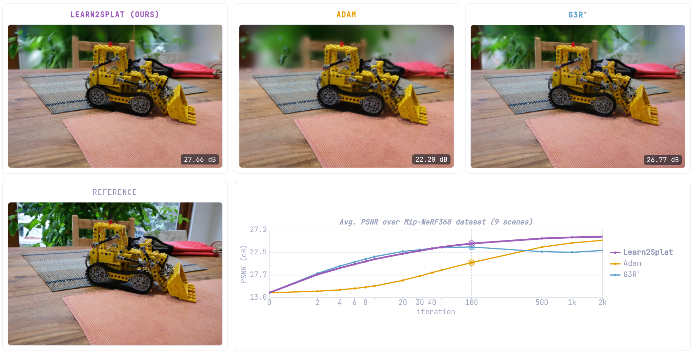

<p align="center">
  <h1 align="center">Learn2Splat: Extending the Horizon of Learned 3DGS Optimization</h1>
  <p align="center">
    <a href="https://naamapearl.github.io/">Naama Pearl</a><sup>1*</sup>
    ·
    <a href="https://s-esposito.github.io/">Stefano Esposito</a><sup>1*</sup>
    ·
    <a href="https://haofeixu.github.io/">Haofei Xu</a><sup>1,3</sup>
    ·
    <a href="https://uni-tuebingen.de/fakultaeten/mathematisch-naturwissenschaftliche-fakultaet/fachbereiche/informatik/lehrstuehle/maschinelles-lernen/team/amit-peleg/">Amit Peleg</a><sup>1</sup>
    ·
    <a href="https://patriciagschossmann.github.io/">Patricia Gschoßmann</a><sup>1</sup>
    ·
    <a href="https://scholar.google.com/citations?user=vW1gaVEAAAAJ">Lorenzo Porzi</a><sup>2</sup>
    ·
    <a href="https://scholar.google.com/citations?user=CxbDDRMAAAAJ">Peter Kontschieder</a><sup>2</sup>
    ·
    <a href="https://virtualhumans.mpi-inf.mpg.de/">Gerard Pons-Moll</a><sup>1</sup>
    ·
    <a href="http://www.cvlibs.net/">Andreas Geiger</a><sup>1</sup>
  </p>
  <p align="center">
    <sup>1</sup> University of Tübingen, Tübingen AI Center &nbsp;·&nbsp;
    <sup>2</sup> Meta Reality Labs &nbsp;·&nbsp;
    <sup>3</sup> ETH Zurich
  </p>
  <p align="center"><sup>*</sup> Equal contribution</p>
  <div align="center"></div>
</p>

<br>
<br>
<h4 align="center">
  <a href="https://autonomousvision.github.io/learn2splat/">Project Page</a>
  &nbsp;·&nbsp;
  <a href="https://arxiv.org/abs/2605.15760">Paper</a>
  &nbsp;·&nbsp;
  <a href="https://huggingface.co/autonomousvision/learn2splat">Checkpoints</a>
</h4>

<p align="center">
  <a href="#quick-start">Quick start</a> &nbsp;·&nbsp;
  <a href="#installation">Installation</a> &nbsp;·&nbsp;
  <a href="#usage">Usage</a> &nbsp;·&nbsp;
  <a href="#configuration">Configuration</a> &nbsp;·&nbsp;
  <a href="#method">Method</a> &nbsp;·&nbsp;
  <a href="#citation">Citation</a>
</p>


<p align="center">
<strong>A meta-learned optimizer for 3D Gaussian Splatting</strong> that achieves faster early on and stays stable across long optimization horizons, without learning-rate schedules or time encodings.
</p>

<p align="center">
  
</p>
<p align="center">
  <em>Novel-view renders after 100 optimization steps. All methods start from the same SfM points at t = 0.</em>
</p>


## Quick start

Install, optimize one scene with the released checkpoint, and print the metrics. The scene (~450 MB)
and the checkpoint are both fetched from Hugging Face, so nothing else has to be downloaded first.

```bash
# 1. install
git clone --recursive https://github.com/autonomousvision/learn2splat
cd learn2splat
bash setup.sh
conda activate learn2splat   # the env setup.sh created

# 2. fetch the demo scene: garden, from MipNeRF-360
hf download autonomousvision/learn2splat --include 'datasets/mip360/garden/*' --local-dir .

# 3. optimize it, starting from the COLMAP points
python -m learn2splat.main +experiment=test_mipnerf360 \
  scene_trainer/scene_optimizer=learn2splat_dense \
  checkpointing.pretrained_optimizer=hf://autonomousvision/learn2splat/joint/checkpoints/epoch_7-step_150000.ckpt \
  dataset.roots=datasets/mip360 \
  dataset.scene_name=garden \
  'meta_trainer.test.save_at_iters=[0,10,50,100,500,1000,2000]' \
  scene_trainer.scene_initializer.path=datasets/mip360 \
  scene_trainer.num_update_steps=2000 \
  scene_trainer.iter_batch_size=8 \
  meta_trainer.test.metrics_batch_size=4 \
  output_dir=results/quickstart

# 4. read the results
python scripts/testing/aggregate_metrics.py results/quickstart
python scripts/show_results_table.py results/quickstart

#  Expected results (may vary slightly):
#  Iter                PSNR            SSIM           LPIPS      Time (min)   Gaussians (M)
#  0                 13.874          0.3085          0.7630            0.00           0.139
#  10                21.324          0.4880          0.5554            0.01           0.139
#  50                23.483          0.6172          0.4490            0.05           0.139
#  100               23.992          0.6498          0.4216            0.10           0.139
#  500               24.664          0.6945          0.3842            0.51           0.139
#  1K                24.812          0.7058          0.3742            1.04           0.139
#  2K                24.924          0.7120          0.3678            2.12           0.139
```

[`demo.py`](demo.py) reuses that same scene to compare against an Adam baseline, or to open an
interactive viewer:

```bash
python demo.py                    # Learn2Splat vs an Adam baseline
python demo.py --with-gui gradio  # interactive viewer on http://localhost:8080
```

## Installation

Our code is developed and tested with PyTorch 2.7.1, Python 3.12 and Ubuntu 22.04, on CUDA 12.6/12.8.

Clone the repository and its submodules:

```bash
git clone --recursive https://github.com/autonomousvision/learn2splat
cd learn2splat
# if already cloned without submodules:
git submodule update --init --recursive
```

The full environment setup is scripted in [`setup.sh`](setup.sh). Run it from the repository root:

```bash
bash setup.sh
conda activate learn2splat
```

This creates the conda env, installs PyTorch + the Python requirements + the
CUDA submodules, and finally installs the `learn2splat` package itself (editable).
After it completes you can run the CLI as `python -m learn2splat.main ...`.

The two optional decoders need a CUDA rasterizer each, which is not built by default. Add them with:

```bash
WITH_OPTIONAL_RASTERIZERS=1 bash setup.sh
```

## Pretrained Models

The pretrained checkpoint is available on [Hugging Face 🤗](https://huggingface.co/autonomousvision/learn2splat), with per-model details in [MODEL_ZOO.md](MODEL_ZOO.md).

A checkpoint is supplied to the pipeline via `checkpointing.pretrained_model=...`, accepting either a local or a Hugging Face path:

```bash
# local file
checkpointing.pretrained_model=/path/to/model.pth

# Hugging Face Hub: hf://<org>/<repo>/<path/in/repo>[@<revision>]
checkpointing.pretrained_model=hf://autonomousvision/learn2splat/joint/checkpoints/epoch_7-step_150000.ckpt
checkpointing.pretrained_model=hf://autonomousvision/learn2splat/joint/checkpoints/epoch_7-step_150000.ckpt@main
```

HF checkpoints are downloaded once into `./checkpoints`, together with the `config.yaml` saved during training, which records the settings they were trained with. Select the architecture on the command line, as the [quick start](#quick-start) and [evaluation](#evaluation) commands do with `scene_trainer/scene_optimizer=learn2splat_dense`; see [CONFIG.md](CONFIG.md#how-checkpoint-configs-are-merged).

Checkpoints can be specified separately to `pretrained_optimizer` or `pretrained_initializer`.

#### ReSplat note 

Our checkpoint was trained against an earlier version of the ReSplat initializer
([`resplat_v1.yaml`](learn2splat/config/scene_trainer/scene_initializer/resplat_v1.yaml)), which reproduces
the numbers in our paper. We release that earlier ReSplat checkpoint as
`hf://autonomousvision/learn2splat/resplat_init/checkpoints/epoch_20-step_100000.ckpt`.

ReSplat's own released checkpoints can also run in this repo.

```bash
python -m learn2splat.main +experiment=test_dl3dv \
  scene_trainer/scene_initializer=resplat_v2_base \
  scene_trainer/scene_optimizer=resplat_v2 \
  scene_trainer.decoder.eps2d=0.1 \
  scene_trainer.num_update_steps=4 \
  checkpointing.pretrained_model=hf://haofeixu/resplat/resplat-base-dl3dv-256x448-view8-1934a04c.pth
```


## Datasets

Learn2Splat is trained and evaluated on RealEstate10K and DL3DV, and evaluated zero-shot on COLMAP-style scenes. For dataset preparation, please refer to [DATASETS.md](DATASETS.md).

## Camera Conventions

The camera intrinsic matrices are normalized, with the first row divided by the image width and the second row divided by the image height.

The camera extrinsic matrices follow the OpenCV convention for camera-to-world transformation (+X right, +Y down, +Z pointing into the screen).


## Usage

### Evaluation

To evaluate the checkpoint on a benchmark, run the matching `test_*` experiment. The checkpoint is
passed as `pretrained_optimizer`, which loads the optimizer weights and leaves the initializer and
dataset to the command line (`pretrained_model` would use the initializer used during training). 

For MipNeRF-360 and standard SfM initialization:

```bash
python -m learn2splat.main +experiment=test_mipnerf360 \
  scene_trainer/scene_optimizer=learn2splat_dense \
  checkpointing.pretrained_optimizer=hf://autonomousvision/learn2splat/joint/checkpoints/epoch_7-step_150000.ckpt \
  output_dir=results/mipnerf360
```

`learn2splat_dense` is the optimizer variant paired with an SfM initialization (no features from the initializer, the per-Gaussian state is randomly sampled).

Add `dataset.scene_name=garden` to run a single scene. 
Modify `scene_trainer.iter_batch_size` to chunk the eval rendering and `meta_trainer.test.metrics_batch_size` to chunk the metric calculation.

Metrics and any requested artifacts are written under `output_dir` (see
[Test output flags](#test-output-flags)). To average the metrics along the dataset:

```bash
python scripts/testing/aggregate_metrics.py results/mipnerf360
```

which writes `<output_dir>/<optimizer>/metrics/averaged/`. See
[scripts/testing/METRICS.md](scripts/testing/METRICS.md) for details.

#### Reproducing the paper results. 
The full multi-dataset evaluation (the released checkpoint and the Adam baselines, with
metric aggregation) is launched per dataset with:

```bash
bash scripts/testing/<dataset>/launch.sh   # <dataset> ∈ dl3dv | re10k | mipnerf360 | dtu | llff | custom
```

It submits SLURM jobs when available and local `bash` otherwise (already calls the aggregation script). See [`scripts/testing/README.md`](scripts/testing/README.md) for configuration and options.

The `#SBATCH` headers in each `<dataset>/test.sh` contain `--partition=***`. Set it to the GPU partition, and check memory and GPU counts.

### Training

Training is launched through SLURM. The submit script handles environment setup, resume and wandb:

```bash
mkdir -p logs   # where SLURM writes the job's stdout/stderr
sbatch scripts/training/submit_train.slurm scripts/training/learn2splat_joint.sh
```

Its `#SBATCH` header also contains `--partition=***`. Set the partition before submitting.

That script reproduces the released checkpoint. It calls
`python -m learn2splat.main +experiment=train_mixed_sparse_dense`, which trains one optimizer on DL3DV over
both regimes: 
- dense scenes with SfM initialization 
  - 64 context views
  - 8 views sampled at each inner-iteration
- sparse scenes with ReSplat initialization
  - 8 context views used in every inner-iteration

## Configuration

Runs are composed with [Hydra](https://hydra.cc/) from the YAML fragments under
[`learn2splat/config/`](learn2splat/config/). [CONFIG.md](CONFIG.md) explains how a run is assembled and which
datasets, initializers, optimizers, decoders, and losses can be swapped in, and how the
architecture is restored from a checkpoint at test time.

### Adaptive Density Control (experimental)

Densification and pruning of Gaussians during optimization is selected via the optimizer's `scene_trainer/scene_optimizer/refiner`
group. It is experimental, and its behavior is not guaranteed.

### Test output flags

`meta_trainer.test.*` controls which artifacts a `mode=test` run writes per scene (e.g.
`meta_trainer.test.save_render_image=true`). The full list, covering images, depth, video, Gaussians
and cameras, is in [scripts/testing/TEST_FLAGS.md](scripts/testing/TEST_FLAGS.md).


## Method

Given initial Gaussians and posed input views, the learned optimizer iteratively refines the
Gaussians toward high-quality novel-view synthesis. It is trained once across many scenes and applied
zero-shot to unseen datasets and resolutions. Three components enable the long stable optimization:

- A *checkpoint buffer* stores intermediate scene states, so meta-training sees both early and late stages of optimization
  (`meta_trainer.train.use_ckpt_buffer`, configured by the `ckpt_buffer_cfg` group).
- An *optimizer rollout* runs the optimizer with frozen weights before a scene state is stored, which
  exposes it to later inner iterations and lets it learn from its own mistakes (`rollout`,
  `rollout_min_steps` / `rollout_max_steps` / `rollout_grow`, inside `ckpt_buffer_cfg`).
- A *kNN-based Point Transformer* captures spatial relationships between Gaussians and encodes
  per-parameter gradient magnitude through a State Scale MLP, producing the update step without time
  encodings or LR schedules (`scene_trainer/scene_optimizer=knn_based`, with `predict_state_scale`). `delta_head_scalar_scale` is another predicted scale factor for the final update step, which is applied after the State Scale MLP.


## Citation

If you find this project useful, please consider citing:

```bibtex
@article{pearl2026learn2splat,
  title   = {Learn2Splat: Extending the Horizon of Learned 3DGS Optimization},
  author  = {Pearl, Naama and Esposito, Stefano and Xu, Haofei and Peleg, Amit and
             Gschoßmann, Patricia and Porzi, Lorenzo and Kontschieder, Peter and
             Pons-Moll, Gerard and Geiger, Andreas},
  journal = {arXiv preprint arXiv:2605.15760},
  year    = {2026}
}
```


## Acknowledgements

This project is built on [ReSplat](https://github.com/cvg/resplat), [pixelSplat](https://github.com/dcharatan/pixelsplat), [MVSplat](https://github.com/donydchen/mvsplat), [gsplat](https://github.com/nerfstudio-project/gsplat), [3D Gaussian Splatting](https://github.com/graphdeco-inria/gaussian-splatting), [FastGS](https://github.com/fastgs/FastGS), [UniMatch](https://github.com/autonomousvision/unimatch), [Depth Anything V2](https://github.com/DepthAnything/Depth-Anything-V2) and [DL3DV](https://github.com/DL3DV-10K/Dataset). We thank the authors for releasing their work.
